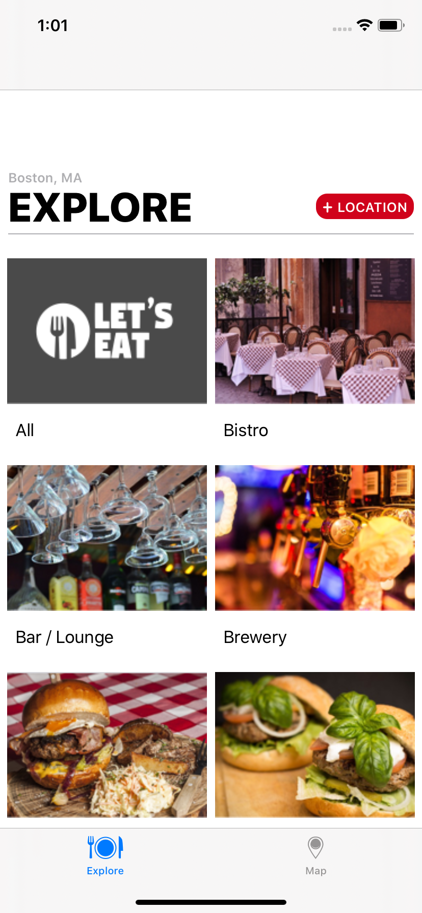
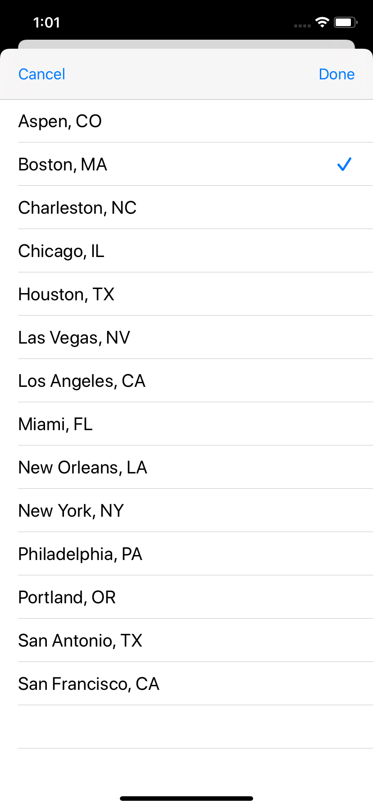
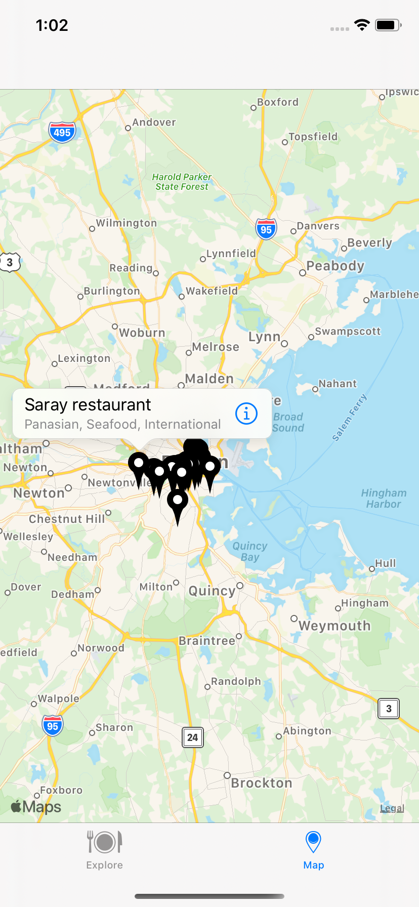
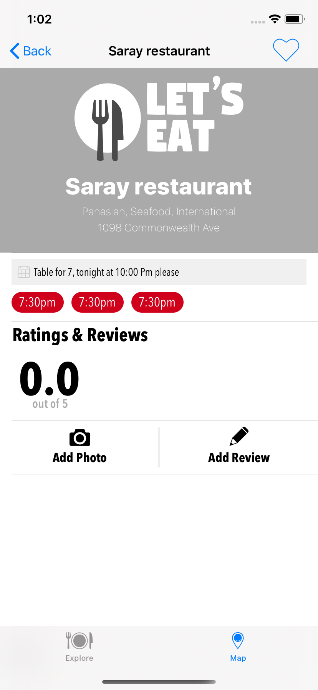

# LetsEat

LetsEat app. This app was designed so that you can find and book a restaurant by its location. This project is unfinished, it still in development. This is an analogue of Lets Eat app. This app is developing for practice on working with UIkit, CoreData, Json, MVC , cocoapods and etc.

Приложение LetsEat. Это приложение было разработано так, чтобы вы могли найти и забронировать ресторан по его местонахождению. Этот проект еще не завершен, он все еще в разработке. Это аналог приложения Lets Eat. 

